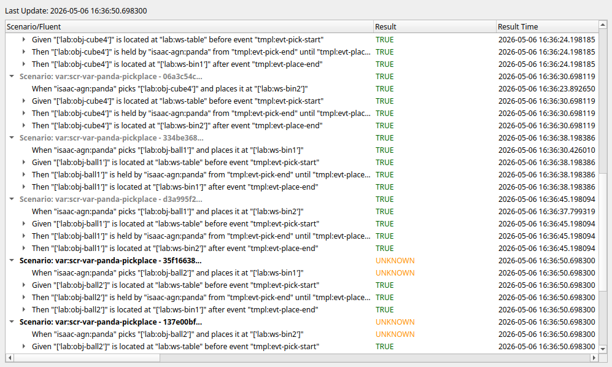

# bdd-exec-ros2

Package for handling execution of RobBDD models using ROS2 communication.
A GUI tool is also available for visualizing test results.

## Dependencies

- Python packages:
  + [rdf-utils](https://github.com/minhnh/rdf-utils)
  + [bdd-dsl](https://github.com/minhnh/bdd-dsl)
  + [coord-dsl](https://github.com/secorolab/coord-dsl)
- ROS packages:
  + [minhnh/bdd_ros2_interfaces](https://github.com/minhnh/bdd_ros2_interfaces)

## Quick start

A mockup setup is available for testing communication between the test coordinator node with
a mockup behaviour action server, which cycle through a pick & place state machine and publishes
the expected events and trinary messages. A more detailed tutorial on the interactions of these
components is available on the [`bdd-dsl` landing page](https://secorolab.github.io/bdd-dsl/).

To run the mockup setup:

1. Run the mockup launch file:

   ```bash
   ros2 launch bdd_exec_ros2 launch_mockup.yaml
   ```

1. (Optional) Run the visualizer:

    ```bash
    ros2 run bdd_exec_ros2 visualizer
    ```

1. Trigger test execution:

    ```bash
    ros2 topic pub /bdd/start std_msgs/msg/Empty "{}" -1
    ```

## Executables

### BDD Test Coordinator

[`bdd_coordination_node.py`](./bdd_exec_ros2/executables/bdd_coordination_node.py) loads BDD model
(as RDF graph or RobBDD) and, when triggered, send goal for each scenario variation to a
[behaviour action server](https://github.com/minhnh/bdd_ros2_interfaces/blob/-/action/Behaviour.action).

### Test Result Visualizer

The [`visualizer.py`](./bdd_exec_ros2/executables/visualizer.py) script visualizes trinaries and clause assertions
for each executed scenario variations. A successful (mockup) test execution should appear like the following:



### Mockup Behaviour Server

[mockup_behaviour_node.py](./bdd_exec_ros2/executables/mockup_behaviour_node.py) cycles through states of a
finite-state-machine (FSM) for a pick & place behaviour, while sending events and trinary messages as expected by
the BDD coordinator node. The [FSM Python implementation](./bdd_exec_ros2/behaviours/fsm_pickplace.py) is generated
from the [FSM model](./models/pickplace.fsm) using [coord-dsl](https://github.com/secorolab/coord-dsl).

## Virtual environment setup with ROS2

If you want to setup a [ROS2 Python virtual environment](https://docs.ros.org/en/rolling/How-To-Guides/Using-Python-Packages.html),
you'd need to allow using the ROS2 Python packages in the environment, e.g. with
[`uv`](https://docs.astral.sh/uv) in `zsh`:

```sh
source /opt/ros/rolling/setup.zsh
cd $ROS_WS_HOME  # where the 'src' folder is located
uv venv --system-site-packages venv
touch ./venv/COLCON_IGNORE
colcon build
```

Additionally you'd need to add the following to `setup.cfg`, if you specify `entry_points` in `setup.py`:

```ini
[build_scripts]
executable = /usr/bin/env python3
```

Now you can activate both environments with:

```sh
source "$ROS_WS_HOME/venv/bin/activate"
source "$ROS_WS_HOME/install/setup.zsh"
```
