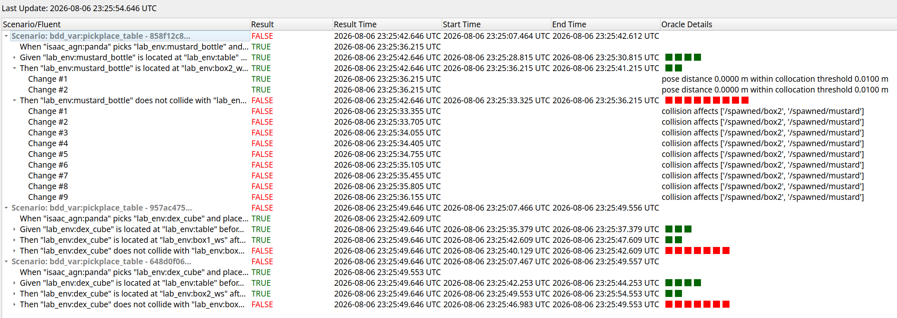

# bdd-exec-ros2

Package for handling execution of RobBDD models using ROS 2 communication.
A GUI tool is also available for visualizing test results.

## Dependencies

- Python DSL/model packages:
  - [rdf-utils](https://github.com/minhnh/rdf-utils)
  - [bdd-dsl](https://github.com/minhnh/bdd-dsl)
  - [coord-dsl](https://github.com/secorolab/coord-dsl)
  - [scene-dsl](https://github.com/secorolab/scene-dsl)
  - [RobBDD](https://github.com/minhnh/robbdd)
- Other Python dependencies include RDFLib, textX, Trinary, PyYAML, NumPy, and SciPy.
- ROS dependencies include `rclpy`, `ament_index_python`, `rosidl_runtime_py`,
  [`simulation_interfaces`](https://github.com/ros-simulation/simulation_interfaces),
  [`bdd_ros2_interfaces`](https://github.com/minhnh/bdd_ros2_interfaces),
  `builtin_interfaces`, `geometry_msgs`, `std_msgs`, and `unique_identifier_msgs`.
- The desktop visualizer requires [PySide6](https://pypi.org/project/PySide6/), while the web
  visualizer requires [aiohttp](https://docs.aiohttp.org/).

## Quick start

A mockup setup is available for testing communication between the test coordinator node and
a mockup behaviour action server, which cycles through a pick-and-place state machine and publishes
the expected events and trinary messages. A more detailed tutorial on the interactions of these
components, including observation providers and simulation-backed execution, is available in the
[`bdd-dsl` execution tutorial](https://secorolab.github.io/bdd-dsl/bdd-tutorial-execution.html).

To run the mockup setup:

1. Run the mockup launch file:

   ```bash
   ros2 launch bdd_exec_ros2 launch_mockup.yaml
   ```

1. (Optional) Run the web visualizer and open <http://127.0.0.1:8080>:

    ```bash
    ros2 run bdd_exec_ros2 web_visualizer
    ```

    The existing desktop visualizer remains available with:

    ```bash
    ros2 run bdd_exec_ros2 visualizer
    ```

    When status timestamps use the simulated `/clock`, run the visualizer with ROS time enabled:

    ```bash
    ros2 run bdd_exec_ros2 web_visualizer --ros-args -p use_sim_time:=true
    ```

1. Trigger test execution:

    ```bash
    ros2 topic pub /bdd/start std_msgs/msg/Empty "{}" -1
    ```

## Executables

### BDD Test Coordinator

[`bdd_coordination_node.py`](./bdd_exec_ros2/executables/bdd_coordination_node.py) loads BDD models
from RDF graphs or RobBDD sources and, when triggered, sends a goal for each scenario variation to a
[behaviour action server](https://github.com/minhnh/bdd_ros2_interfaces/blob/main/action/Behaviour.action).

By default, `scene_setup_mode` is `none` and variations retain their concurrent execution behavior.
Set it to `simulation` to prepare variations sequentially through `SimInterface`: the coordinator
loads or resets the exact scene instance, spawns its invariant and variable-selected elements, and
starts the behaviour only after setup succeeds. `simulation_service_namespace` defaults to `/`, and
`world_entity_name` defaults to `world`.

The complete observation-provider contract, `ObservationManager` API, evaluator forms, and
simulation polling lifecycle are documented in the
[`bdd-dsl` execution tutorial](https://secorolab.github.io/bdd-dsl/bdd-tutorial-execution.html).

For example, with a working simulator exposing ROS 2 `simulation_interfaces` services:

```bash
ros2 launch bdd_exec_ros2 launch_mockup_robbdd.yaml \
  scene_setup_mode:=simulation \
  simulation_service_namespace:=/ \
  world_entity_name:=world
```

### Simulation Interface Test

[`sim_interface_test.py`](./bdd_exec_ros2/executables/sim_interface_test.py) is an interactive
reference client that showcases the main `SimInterface` APIs:

| Command | `SimInterface` API | Purpose |
| --- | --- | --- |
| `list-features` | `get_sim_features()` | Display the simulator's advertised capabilities and spawn formats. |
| `load-scene` | `setup_scene()` | Load or reset a world, spawn the selected SceneX instance, and start simulation. |
| `get-pose` | `get_element_pose()` | Query the current stamped pose of a scene element. |
| `reset` | `reset_simulation()` | Perform a basic simulation reset. |

The tool assumes a running simulator with a working ROS 2 `simulation_interfaces` setup, such as
one provided by Gazebo or Isaac Sim. It does not start or configure the simulator itself.
After a successful `load-scene`, the simulation is left playing.

Set the installed example path and inspect the simulator:

```bash
MODEL="$(ros2 pkg prefix bdd_exec_ros2)/share/bdd_exec_ros2/models/robbdd/lab.scenex"

ros2 run bdd_exec_ros2 sim_interface_test list-features
ros2 run bdd_exec_ros2 sim_interface_test load-scene --scene-model "$MODEL"
ros2 run bdd_exec_ros2 sim_interface_test get-pose \
  --scene-model "$MODEL" --element-id lab_env:dex_cube
ros2 run bdd_exec_ros2 sim_interface_test reset
```

`get-pose` expands `--element-id` as a CURIE using the SceneX graph namespaces and queries an
already-loaded entity; it does not load or reset the scene. Use `--service-namespace` when the
simulation services are namespaced, and `--world-entity-name` when the simulator's world entity is
not named `world`.

### Test Result Visualizer

The [`web_visualizer.py`](./bdd_exec_ros2/executables/web_visualizer.py) script serves a seekable
timeline at <http://127.0.0.1:8080>. It groups events, scenarios, behaviours, and observation-policy
trinaries into lanes and exposes their details without a JavaScript framework. It subscribes only
to coordinator status; the event lane is reconstructed from each scenario's embedded event history.
Available options are:

- `-t, --topic` (default: `/bdd/status`)
- `--host` (default: `127.0.0.1`)
- `--port` (default: `8080`)

The original [`visualizer.py`](./bdd_exec_ros2/executables/visualizer.py) desktop UI remains
available.

The RobBDD
mockup model includes a no-collision policy. Run it with `simulate_collision:=true` to see the
policy fail and its affected bodies reported in the visualizer:

```bash
ros2 launch bdd_exec_ros2 launch_mockup_robbdd.yaml simulate_collision:=true
ros2 run bdd_exec_ros2 web_visualizer
ros2 topic pub /bdd/start std_msgs/msg/Empty "{}" -1
```

Without collision messages, the policy defaults to a successful `no collision recorded` result.
Custom RobBDD observation policies now reference evaluator classes, for example
`bdd_exec_ros2.observation.TargetsDoNotCollideEvaluator`, which own their result and reason.



### Mockup Behaviour Server

[mockup_behaviour_node.py](./bdd_exec_ros2/executables/mockup_behaviour_node.py) cycles through states of a
finite-state machine (FSM) for a pick-and-place behaviour while sending events and trinary messages expected by
the BDD coordinator node. The [FSM Python implementation](./bdd_exec_ros2/behaviours/fsm_pickplace.py) is generated
from the [FSM model](./models/pickplace.fsm) using [coord-dsl](https://github.com/secorolab/coord-dsl).

## Virtual environment setup with ROS 2

To set up a [ROS 2 Python virtual environment](https://docs.ros.org/en/jazzy/How-To-Guides/Using-Python-Packages.html),
allow the environment to use the system ROS 2 Python packages, for example with
[`uv`](https://docs.astral.sh/uv) in `zsh`:

```sh
source /opt/ros/jazzy/setup.zsh
cd $ROS_WS_HOME  # where the 'src' folder is located
uv venv --system-site-packages venv
touch ./venv/COLCON_IGNORE
colcon build
```

The included `setup.cfg` installs Python entry points in the location expected by ROS 2.

Now you can activate both environments with:

```sh
source "$ROS_WS_HOME/venv/bin/activate"
source "$ROS_WS_HOME/install/setup.zsh"
```
